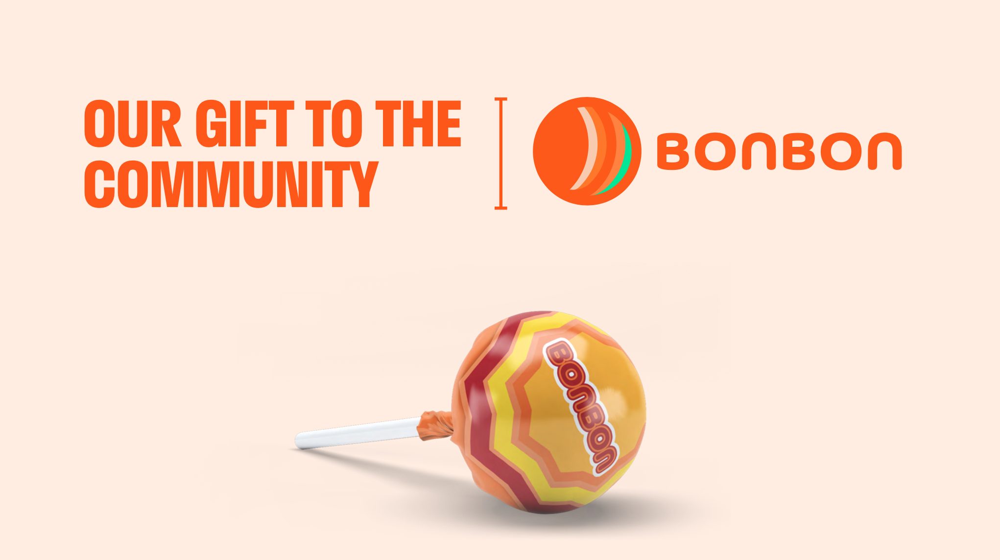
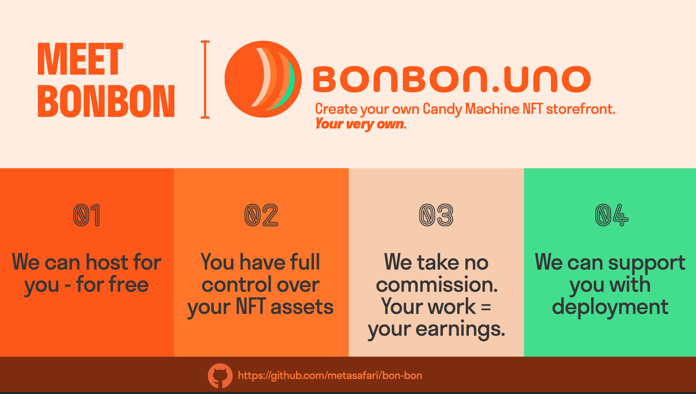
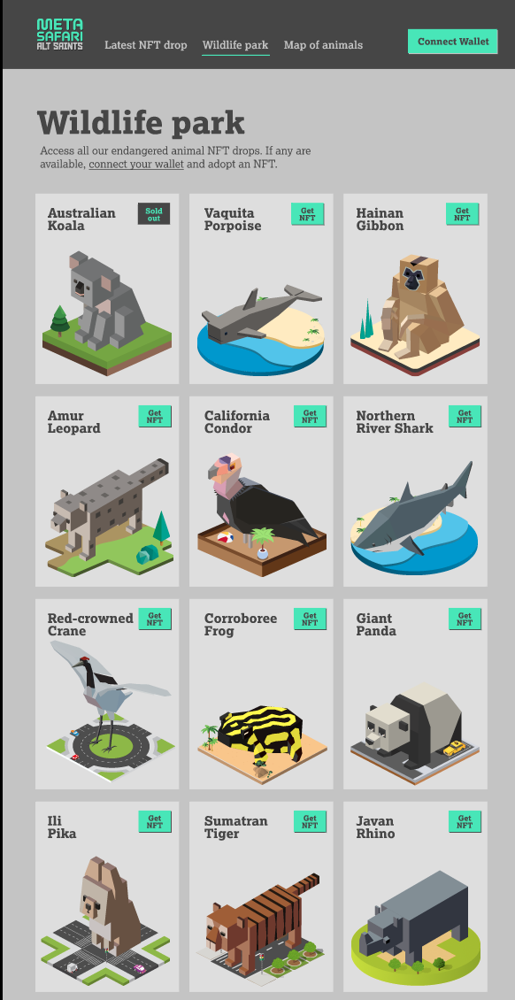
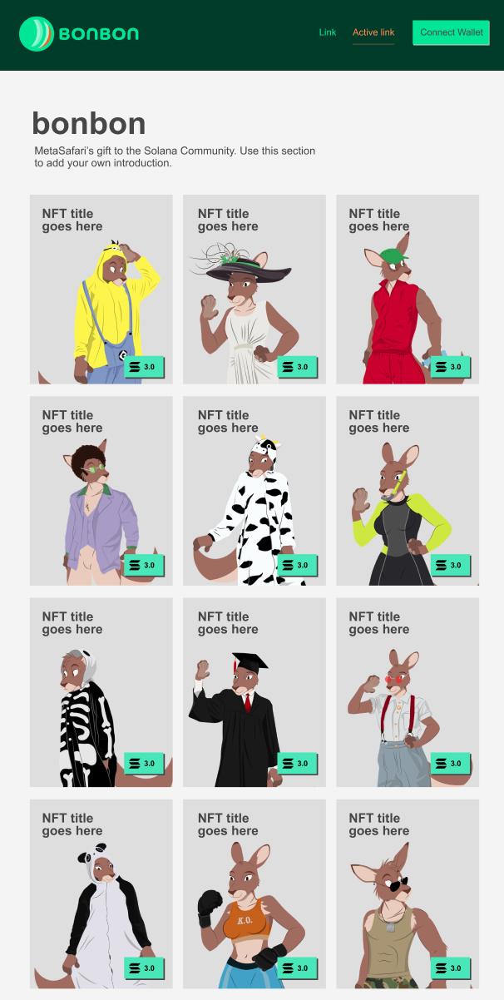
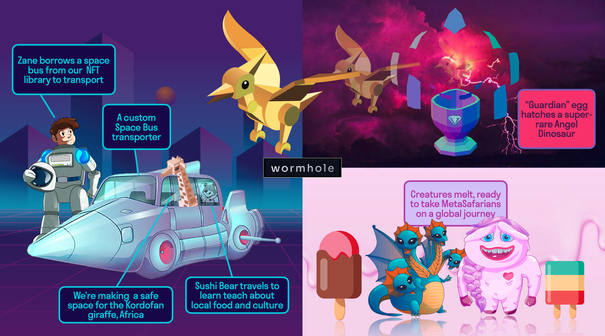

# B◎NB◎N

## OUR GIFT TO THE COMMUNITY

### List your **Candy-Machine** for FREE at [B◎NB◎N](https://www.bonbon.uno/)

### and / or

### Create your own **Candy-Store** with multiple Candy-Machine(s)

### We have a unique scenario, where we had to build, deploy and host multiple new candy-machine(s) every week for one of our tribes, [Alt Saints](https://metasafari.world/project-1/).

#### After extensive research and talking to multiple builders in the ecosystem, we were led on this path to building our own platform, [Wildlife Park](https://www.metasafari.uno/).

### Today, we are delighted to announce that we are open sourcing the codebase, UI design files to our beloved community.

### Feel free to use these resources for your project. And if you're so inclined to create your own candy-machine, and/or candy-store ...we are here to help, share our experiences, so as to help you successfully launch your idea.

### To kick things of, we plan to create, deploy and host a few candy-machines filled with some really cool NFTs for you to **MINT for FREE**. Yes you heard that right, you cover the network fee and we priced these goodies at ` 0 s◎l` as a thank you.

### Our elves are busy building these candy-machines and we shall deploy them progressively in coming weeks. Keep an eye out in our socials, so you can get them at [B◎NB◎N](https://www.bonbon.uno/) as soon as they are deployed to `mainnet`.

### This is just the beginning of many delightful opportunities our community members shall experience in coming months and years.

---

# LET's PLAY

## [DISCORD](metasafari) | [GITHUB](https://github.com/metasafari/bon-bon) | [TWITTER](https://twitter.com/metasafari) | [INSTAGRAM](https://www.instagram.com/meta.safari/) | [WEB](https://metasafari.world/)

---
